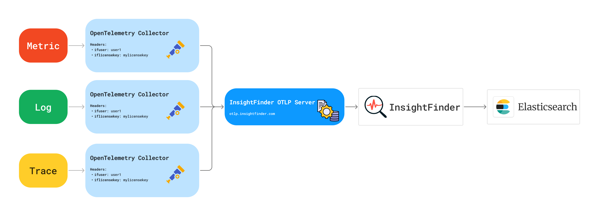

# InsightFinder OpenTelemetry Service

InsightFinder OpenTelemetry service can receive log and trace from OpenTelemetry collector via gRPC/OTLP protocol and send to InsightFinder Engine.
InsightFinder OTLP service can be deployed either on any cloud environment or inside a datacenter protected by a firewall.

To connect to this service, we just need to add one OLTP exporter with two additional headers to the `exporters` section of the OT collector.

## Prerequisite
- OpenJDK 21+

## Dev
1. Go to InteliliJ IDEA Configuration and add a new `Application` configuration.
2. Set `Main class` to `com.insightfinder.otlpserver.GRPCServer`
3. Set `Working Directory` to `src/main/resources`
4. You can run this agent now.

## Build
```shell
mvn clean package
java -jar otlpserver-1.0.0-SNAPSHOT-jar-with-dependencies.jar
```

## Deployment
1. Download the prebuild jar file (e.g `otlpserver-1.0.0-SNAPSHOT-jar-with-dependencies.jar`).
2. Create `server.yaml` and `data.yaml` under the same directory as the jar file. See example [here](src/main/resources).
3. Edit those two configuration files based on your needs.
4. Start the server with `java -jar <YOUR_JAR_FILE>`

## Configure
### Server Configuration
Example: [server.yaml](src/main/resources/server.yaml)
```yaml
# InsightFinder Engine URL
insightFinderUrl: "https://stg.insightfinder.com"

# The gRPC server listen port
port: 4317

# TLS/SSL settings.
tls:
  enabled: false

  # Path to full-chain certificate file (PEM)
  certificateFile: ''

  # Path to the private key file.
  privateKeyFile: ''

# Worker Thread Configurations.
worker:
  # DataProcess worker: Extracting information from the original data.
  processThreads: 1

  # Streaming worker: Send data to InsightFinder.
  streamingThreads: 1
  streamingBatchSize: 100
```
### Data Processing Configuration
Example: [data.yaml](src/main/resources/data.yaml)
#### Extraction
```yaml
users:
  # InsightFinder username
  demoUser:
    # InsightFinder licenseKey
    licenseKey: ""
    
    # Rules to process log data.
    log:
      extraction:
        
        # The rule to extract projectName from the data
        projectFrom:
          - source: ''
            field: ''
            regex: ''
        
        # (Optional)
        # The rule to extract projectName from the data
        systemFrom:
          - source: ''
            field: ''
            regex: ''
        
        # The rule to extract instanceName from the data
        instanceFrom:
          - source: ''
            field: ''
            regex: ''

        # (Optional)
        # The rule to extract component from the data
        componentFrom:
          - source: ''
            field: ''
            regex: ''
        
        # The rule to extract timestamp from the data
        timestampFrom:
          - source: ''
            field: ''
            
      filter:
        sensitive:
          jsonFieldName:
          #            - "something"
          stringContent:
    #            - "something"

    # Rules to process trace data.
    trace:
      extraction:

        # The rule to extract projectName from the data
        projectFrom:
          - source: ''
            field: ''
            regex: ''

        # (Optional)
        # The rule to extract systemName from the data
        systemFrom:
          - source: ''
            field: ''
            regex: ''
            
        # The rule to extract instanceName from the data
        instanceFrom:
          - source: ''
            field: ''
            regex: ''
        
        # (Optional)
        # The rule to extract componentName from the data
        componentFrom:
          - source: ''
            field: ''
            regex: ''
```
To configure the extraction rules, you can set different types of `source` fields.

| Source | Description                                                                                           | Use with    | SupportedBy                                                                         |
|--------|-------------------------------------------------------------------------------------------------------|-------------|-------------------------------------------------------------------------------------|
| body   | It will search data in the data body. If the data is JSON, it will search data in the specific field. | field,regex | projectFrom<br/> systemFrom  <br/> instanceFrom  <br/> componentFrom  <br/> timestampFrom |
| header | It will search data in the Header configure in the OpenTelemetry                                      | field,regex | projectFrom  <br/> systemFrom  <br/> instanceFrom  <br/> componentFrom              |
| static | It will use the value from `value` field as the result                                                | value       | projectFrom  <br/> systemFrom  <br/> instanceFrom  <br/> componentFrom              |
| sender | It will use the data receiving time as the timestamp.                                                 |             | timestampFrom                                                                       |

##### Example 1: Get InstanceName from Log JSON data
This example shows how to extract the instanceName from the data body and use it as the instanceName.
```yaml
users:
  demoUser:
  licenseKey: 'mylicenseKey'
  log:
    extraction:
      instanceFrom:
        - source: 'body'
          field: 'hostname'
          regex: '.*'
```

#### Example 2: Set static projectName and SystemName
This example show how to set up the static project and system name so that we can stream everything to one project.
```yaml
users:
  demoUser:
  licenseKey: 'mylicenseKey'
  log:
    extraction:
      # The rule to extract projectName from the data
      projectFrom:
        - source: 'static'
          value: 'myproject'
      systemFrom:
        - source: 'static'
          value: 'mysystem'
```

#### Log filter (Optional)

`users.log.filter` defines all the log data filter rules. If any log content matched the filter
rule, the content will be removed from the log data before sending to InsightFinder.

We support two types of filter rules for two types of log data:

1. Filter **plain text log** (non-JSON format) by regex: provide one or multiple word, sentence or
   regex
   in `stringContent` to remove all contents in the log data that match the regex.
2. Filter **JSON log data** by JSON field and regex: provide one or multiple json field name
   expression
   and value regex in `jsonFieldName` to remove all contents to the JSON field in the log data that
   match the regex.
   - Remove JSON field: if only provide the field name expression, the whole field will be removed.
   - Remove the JSON field value matching content: if provide the field name expression and the
     value regex, only the value that matches the regex will be removed. Use `=` to connect field
     name expression
     and value matching regex, i.e `filedNameExp=regex`.

   JSON field name expression: `field1->field2->field3...` where `field1` is the top-level field
   name in the JSON data. If the field is nested, use `->` to separate the field name.

## Example Data
Trace data body should look like the following:
```json
{
    "duration": 16217000,
    "spanID": "8983dee474342b3a",
    "traceID": "a70eb390a8513a402bd1fcf647c86610",
    "spanAttributes": {
        "net.host.name": "192.168.50.78:5001",
        "net.peer.port": 55639,
        "http.target": "/",
        "http.flavor": "1.1",
        "net.peer.ip": "192.168.50.78",
        "http.host": "192.168.50.78:5001",
        "http.status_code": 200,
        "http.server_name": "0.0.0.0",
        "http.user_agent": "Mozilla/5.0 (Macintosh; Intel Mac OS X 10.15; rv:129.0) Gecko/20100101 Firefox/129.0",
        "net.host.port": 5001,
        "http.route": "/",
        "http.method": "GET",
        "http.scheme": "http"
    },
    "operationName": "GET /",
    "startTime": 1725037512340642000,
    "endTime": 1725037512356859000,
    "traceAttributes": {
        "telemetry.sdk.language": "python",
        "service.name": "flask-service",
        "telemetry.sdk.version": "1.26.0",
        "telemetry.sdk.name": "opentelemetry"
    }
}
```